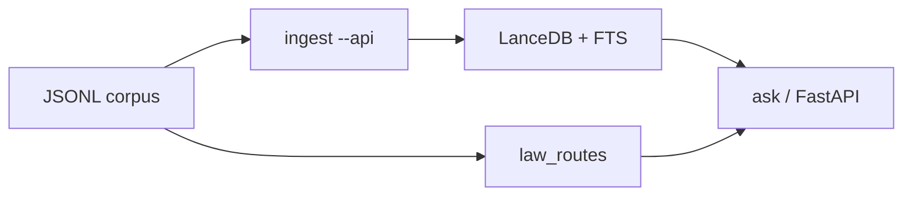

# Architecture — Iraqi Legislation RAG

End-to-end path strangers can run with only `OPENROUTER_API_KEY`:

## Components

| Module | Role |
|--------|------|
| `common.py` | Paths, chunking, article extraction, OpenRouter model lists, `.env` loader |
| `ingest.py` | Embed JSONL → LanceDB (`--api` default path); `--build-fts` for BM25 |
| `build_law_registry.py` | Offline title/alias registry + `law_routes` embeddings |
| `law_registry.py` | Instrument phrases, seed aliases, registry I/O |
| `ask.py` | Hybrid BM25+vector retrieve, confidence-gated routing, answer + verify |
| `rag_service.py` | Same engine for CLI and HTTP |
| `setup_store.py` | One command: ingest → FTS → routes |
| `eval_recall.py` | Recall@k gold (sample suite auto-selected on small stores) |
| `web/app.py` | `GET /health`, `POST /api/ask` only |

## Retrieval

1. Embed the question (`baai/bge-m3` via OpenRouter).
2. Hybrid: LanceDB vector + FTS (`RRFReranker`); Arabic FTS without English stemming defaults.
3. Optional law routing: registry phrase/seed match + title vectors; **high** confidence (named statute) puts routed chunks ahead of hybrid; **low** (topical) keeps hybrid first.
4. Exact-article lookups can short-circuit generation and return verbatim text.
5. Answers cite retrieved text; default filter is in-force (`ساري`) only.

## Data

- Schema: `schemas/law_record.schema.json`
- Git ships `sources/sample_laws.jsonl` only (synthetic).
- Full `laws_master.jsonl` comes from Releases / HF / scraper (Phase 3) — not git.

## Scope

Search and drafting aids, **not** legal advice. Disclaimer strings are attached in CLI/API output regardless of model cooperation.
