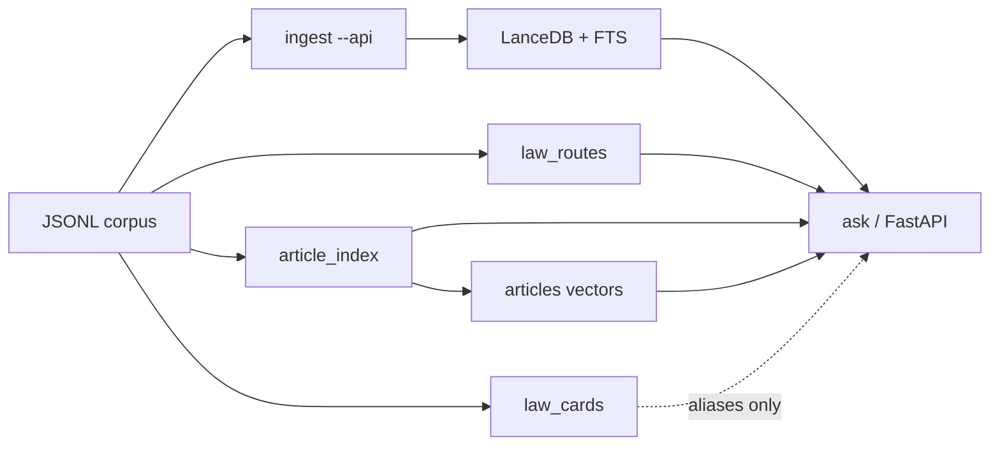

# Architecture — Iraqi Legislation RAG

End-to-end path strangers can run with only `OPENROUTER_API_KEY`:



## Components

| Module | Role |
|--------|------|
| `common.py` | Paths, chunking, article extraction, OpenRouter model lists, `.env` loader |
| `ingest.py` | Embed JSONL → LanceDB (`--api` default path); `--build-fts` for BM25 |
| `build_law_registry.py` | Offline title/alias registry + `law_routes` embeddings |
| `law_registry.py` | Instrument phrases, seed aliases, optional card lexicon, registry I/O |
| `build_law_cards.py` | Upfront LLM cards → `cache/law_cards.jsonl` + `alias_lexicon.jsonl` |
| `law_cards.py` | Card schema/parse + lexicon (**routing/UI only**) |
| `query_plan.py` | Deterministic QueryPlan shapes + quota / diversity fusion |
| `ask.py` | Hybrid + article defines + routed retrieve via QueryPlan |
| `rag_service.py` | Same engine for CLI and HTTP |
| `setup_store.py` | ingest → FTS → routes → article index → article embed → verify |
| `build_article_index.py` | Deterministic `cache/article_index.jsonl` (`defines` vs `mentions`) |
| `embed_articles.py` | OpenRouter bge-m3 embed of defines → LanceDB `articles` |
| `scripts/verify_store.py` | Presence checks for FTS / routes / article_index / articles |
| `eval_recall.py` | Recall@k gold (sample suite auto-selected on small stores) |
| `web/app.py` | `GET /health`, `POST /api/ask` only |

## P0 — article index (`defines` vs `mentions`)

```powershell
python build_article_index.py --source sources/sample_laws.jsonl
python scripts/verify_store.py --sample --skip-registry --skip-articles-table
pytest tests/test_article_index.py -q
```

Output: `cache/article_index.jsonl` — defining articles vs in-body citations.
Wired into `setup_store.py` after routes (skip with `--skip-article-index`).

## P1a — article vectors + QueryPlan fusion

**Article-level embeddings** (~$1 full corpus est.; sample is cents):

```powershell
python embed_articles.py --api --source sources/sample_laws.jsonl
python setup_store.py --limit 50
```

Resumable by `article_id`. Skip with `--skip-article-embed`.

**Retrieve:** QueryPlan classifies question shape. Legs fill `k` under per-leg
quotas and per-law diversity. Exact lookups prefer `article_index` **defines**
(and `articles` vectors when present); hybrid chunks remain the fallback.

```powershell
pytest tests/test_query_plan.py tests/test_routing_unit.py -q
```

## P1b — law cards + alias lexicon

One JSON-constrained OpenRouter call per in-force law produces a **law card**:
neutral scope summary, subject tags, colloquial aliases, likely questions,
optional English title (title + truncated `full_text`). Output:

- `cache/law_cards.jsonl` (gitignored)
- `cache/alias_lexicon.jsonl` (routing feed)
- `docs/examples/sample_law_cards.jsonl` (tiny committed fixture)

```powershell
python build_law_cards.py --sample
python build_law_cards.py --limit 20
python build_law_cards.py --priority --limit 100   # resumable; Ctrl-C safe
python build_law_cards.py                          # resume full in-force corpus
python build_law_cards.py --rebuild-lexicon-only
pytest tests/test_law_cards.py -q
```

Source resolution: `--sample` → sample fixture; else prefer sibling
`C:\iraqi-law-rag\sources\laws_master.jsonl` when present; else local
`laws_master` / sample. Resumes by skipping `law_book_id`s already in the
cards file. Full in-force corpus ≈ **$8–14**; sample run measured ~$0.003.

Loads `OPENROUTER_API_KEY` from local `.env` or sibling `iraqi-law-rag/.env`
(never commit `.env`).

### CRITICAL — routing/UI only

**Law cards must never be injected into the answer LLM context.** They are
metadata for colloquial alias → `law_book_id` routing and future UI
(summaries/tags — mark غير قابل للاستشهاد). Answer generation still sees
**retrieved law chunks / articles only**. Missing cards/lexicon → fall back
to deterministic `SEED_ALIAS_RULES` + instrument phrases + title vectors.

Hand-written seeds stay authoritative; card/lexicon aliases append after them
(`laws_matching_seed_aliases` / `laws_matching_card_aliases`).

## Retrieval (runtime)

1. Embed the question (`baai/bge-m3` via OpenRouter).
2. Build QueryPlan (deterministic, no LLM) when available.
3. Run legs: hybrid RRF, article exact/defines, law-scoped chunks/articles,
   title LIKE, seed/card-alias route.
4. Fuse with weighted RRF + quotas + dedupe.
5. Exact-article lookups can short-circuit generation and return verbatim text.
6. Default filter: in-force (`ساري`) only.

## Data

- Schema: `schemas/law_record.schema.json`
- Git ships `sources/sample_laws.jsonl` only (synthetic).
- Full `laws_master.jsonl` comes from Releases / HF / scraper — not git.

## Scope

Search and drafting aids, **not** legal advice. Disclaimer strings are attached in CLI/API output regardless of model cooperation.
